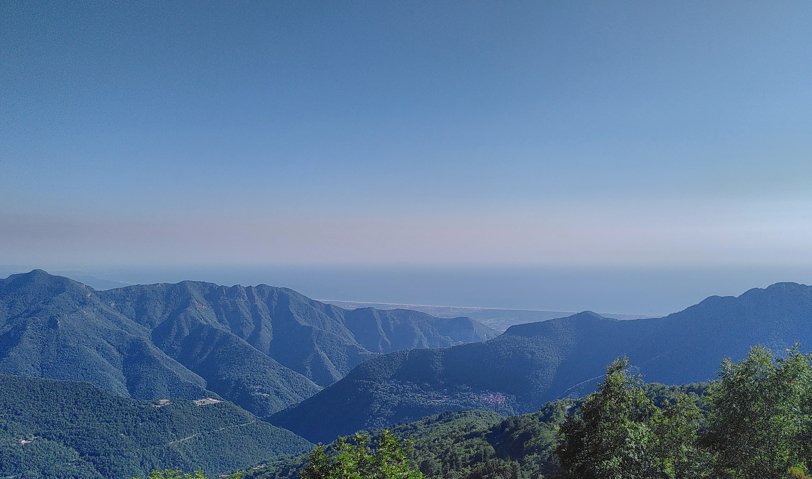
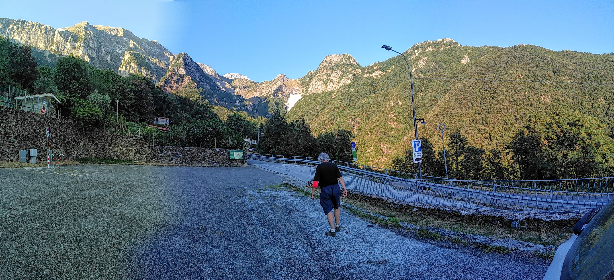

Mio babbo mi ha accompagnato in macchina presso **Terrinca**, il paese più antico della Versilia.

## La Big Bench di Terrinca

Innanzitutto abbiamo visto su Google Maps se attorno c'era qualcosa d'interessante, grazie ad esso abbiamo scoperto l'esistenza della "Big Bench", piena di ottime recensioni. La _Big Bench_ non è altro (nomen omen) che una **grande panchina**, dove oltre alla possibilità di sdraiarsi in diversi si può anche restare in piedi. 

Tale panchina è situata ad una decina di minuti in auto da Terrinca ed è stata costruita grazie ad uno sforzo della comunità del luogo. 

Si trova in un punto panoramico stupefacente: da essa si vedono Viareggio, Forte dei Marmi ed anche le Alpi Apuane, con una vista non ostruita da alberi, dunque un panorama quasi a 360°.

Inoltre, devo ammettere che la suggestione di trovarsi tra le montagne che ottant'anni fa sono state percorse dai soldati tedeschi e dai partigiani trasmette una sensazione di bellezza quasi inquietante. 

### Parcheggio ed accessibilità

Il parcheggio è a pagamento dopo i quindici minuti di sosta gratuita, ed è presente un parchimetro. La strada che porta alla _Big Bench_ non ha un'uscita per le macchine, ma è possibile incamminarsi su un sentiero chiuso al transito di auto da una sbarra. Il parchimetro si trova vicino ad uno scorcio sulle Apuane, una cinquantina di metri prima della _Big Bench_.

Si raggiunge **preferibilmente** in auto, oppure con una passeggiata di due ore da Terrinca, dove si trova una fermata del bus, operata da [Autolinee Toscane](https://www.at-bus.it/it/).



Per raggiungere la _Big Bench_ bisogna salire delle scalette ripide, scavate nel terreno, aiutandosi con un corrimano di legno. Se avete un disabile in famiglia, purtroppo non è possibile  portare la carrozzina nel punto di osservazione rialzato dove si trova la _Big Bench_.

### Foto del panorama

Comunque sia, ecco alcune foto che ho scattato la col mio telefono. 

Ho un Fairphone 3 quindi non aspettatevi una qualità o risoluzione in Megapixel tale da apprezzare i dettagli delle immagini.



Dopo la passeggiata abbiamo deciso di farci un giro in paese.

## Terrinca

Appena parcheggiato ci siamo diretti a piedi verso il borgo ed inizialmente abbiamo visto diversi graffiti ed incisioni su pietra, la strada sembrava un "museo a cielo aperto" ovviamente le "esposizioni" erano copie con interessanti schede contenenti la storia e la datazione dei reperti originali condensate in una decina di righe. 



### La Madonna del Carmine

Abbiamo visto anche una panchina contro la violenza sulle donne che evocava lontanamente l'immagine della _Big Bench_ ed un bivio che portava alla Chiesa ed in una strada senza uscita. La Chiesa si trova _sotto_ al borgo quindi suppongo che le persone si ritrovino per giungere insieme anche a messa

Terrinca infatti è anche un paese molto religioso, testimone anche la statua della Madonna del Carmine, venerata per aver salvato il paese dall'esplosione delle mine installate dai tedeschi durante la II guerra mondiale.

Terrinca inoltre era anche prossimo alla Linea Gotica; grazie ad una scheda informativa accanto alla _Big Bench_ mi sono immaginato l'arrivo in massa dei tedeschi dalle montagne.

### Foto del Borgo



Il paese dà un'impressione di deprecato, un po'come un modulo di Python 2, però ciò lo rende anche interessante. Sembra di entrare in un mondo antico, complici anche i fondi successivi all'Alluvione del Cardoso utili per preservare l'aspetto originale del paese.

### Un paio di ristoranti

Riguardo a dove mangiare nel cuore del paese, oltre all'imponente statua della Madonna del Carmine che veglia le case c'è anche la locanda "Tassilone il Longobardo", valutata con 4,6 stelle su Google Maps. Noi non siamo andati a mangiare lì ma a _L'Osteria_ a Levigliani.

Levigliani è un'altro paesino piccolo vicino a Terrinca, distante solo 5 minuti in macchina e 20 a piedi. 

L'Osteria di Levigliani ha del cibo dignitoso - consiglio i piatti di carne, molto buoni - ma soprattutto una vista sulle montagne degna di nota e spesso ospita delle "serate musicali".

